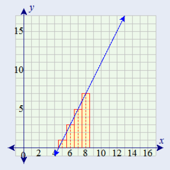

  
## Question 1

**Use integration by substitution to solve the integral below.**
  
$$ \int{4e^{-7x}dx}$$
  
The integral of a constant times a function is the constant times the integral of the function so

$$ \int{4e^{-7x}dx} \rightarrow 4 \int{e^{-7x}dx}$$
  
Let u = -7x

$$ du = -7dx \rightarrow \frac{du}{-7}=dx\rightarrow dx = -\frac{1}{7}du$$
  
Substituded in

$$ 4 \int{e^{-7x}dx} \rightarrow 4\int{-\frac{e^u}{7}du} \rightarrow -\frac{4}{7}\int{e^u du}$$
  
Since  $\int{e^u du} = e^u$ we get

$$ -\frac{4}{7}\int{e^u du} \rightarrow -\frac{4}{7}e^u$$
  
Substitute for u we get

$$ -\frac{4}{7}e^{-7x} + C$$
  
## Question 2
  
**Biologists are treating a pond contaminated with bacteria. The level of contamination is changing at a rate of $\frac{dN}{dt}=-\frac{3150}{t^4}-220$ bacteria per cubic centimeter per day, where t is the number of days since treatment began. Find a function N(t) to estimate the level of contamination if the level after 1 day was 6530 bacteria per cubic centimeter.**
  
$$\int{-\frac{3150}{t^4}-220 dt}\rightarrow-220t-3150\frac{1}{-3t^3}\rightarrow-220t+\frac{1050}{t^3} + C$$
  
To solve for the constant we solve for $C$ given that $N(t) = 6530$
  
$$6530 = -220(1)+\frac{1050}{(1)^3} + C \rightarrow 6530 = -220 + 1050 + C \rightarrow 6530 = 830 + C \rightarrow 5700 = C$$
  
The function is $N(t)=\frac{1050}{t^3}-220t+5700$
  
## Question 3
  
**Find the total area of the red rectangles in the figure below, where the equation of the line is $f(x) = 2x-9$.**
  


The area under the line is a triangle from 4.5 to 8.5.  The height is found by pluging 8.5 into the function.

$$f(8.5)=2(8.5)-9=17-9=8$$
  
The area of the triangle is 1/2 base x height so 

$$\frac{1}{2}(8.5 - 4.5) \times 8 = \frac{1}{2}(4) \times 8 = 2 \times 8 = 16$$
  
So the area is 16.  Verifying with R

```{r, comment=NA}
fx <- function(x){
  2*x-9
}
integrate(fx, 4.5, 8.5)
```

## Question 4

**Find the area of the region bounded by the graphs of the given equations **
  
$$f(x)=x^2-2x-2, g(x)=x+2$$
  
First we will visualize the two lines.  The first is blue and the second is red.

```{r, echo=FALSE, warning=FALSE}
library(ggplot2)

fx <- function(x){x^2 - 2*x - 2}
gx <- function(x){x + 2}

ggplot(data = data.frame(x = 0), mapping = aes(x = x)) +
  stat_function(fun = gx, color="red") + 
  stat_function(fun = fx, color="blue") +
  geom_hline(yintercept = 0, color="black") +
  geom_vline(xintercept = 0, color="black") +
  xlim(-8, 8) +
  ylim(-8, 8) +
  theme(aspect.ratio=1)
```

The two points where the lines intersect are

$$x^2-2x-2 = x+2 \rightarrow x^2-3x -4 = 0\rightarrow(x+1)(x-4) = 0\rightarrow x = -1 \text{ and } 4$$
  
  $$\int_{-1}^4{(x+2)-(x^2-2x-2)} $$
  
```{r, comment=NA}
fx <- function(x){
  (x+2)-(x^2 - 2*x - 2)
}
integrate(fx, -1, 4)
```

## Question 5

**A beauty supply store expects to sell 110 flat irons during the next year. It costs $3.75 to store one flat iron for one year. There is a fixed cost of $8.25 for each order. Find the lot size and the number of orders per year that will minimize inventory costs.**
  
I am assuming sales are uniform throughout the year (no seasonality).  I am also assuming that there is no lag between ordering and receiving the items.  I am also assumuing that the orders will be for the same lot size.  I am also assuming that I am starting with zero irons in inventory on day one.

Total costs are the sum of the carrying/holding costs (H(x)) and the reordering costs(R(x)).  


$$H(x) =  3.75 \times \frac{x}{2} \rightarrow H(x) = 1.875x$$
and

$$R(x) = 8\times\frac{110}{x}\rightarrow R(x)=\frac{880}{x}$$

So total costs as a function is:

$$C(x) = 1.875x + \frac{880}{x}$$

We will take the first derivative and set it equal to zero and solve for x to find the number of orders to minimize the costs. 

$$C'(x) =1.875 - \frac{880}{x^2}$$

$$0 =1.875 - \frac{880}{x^2}$$

$$-1.875 = - \frac{880}{x^2}$$

$$-1.875 x^2= - 880$$

$$x^2 = \frac{-880}{-1.875}$$

$$x = \sqrt{\frac{880}{1.875}} = 21.6641 $$
**The costs are minimized at 22 orders with 5 irons per order**

The blue line in the following graph is the cost function and the red point is where it is minimized.

```{r, echo=FALSE}
library(ggplot2)
get_costs <- function(x){
  return(1.875 * x + (880 / x))
}

df <- data.frame(orders = 1:110, costs = get_costs(1:110))
m <- df[df$costs == min(df$costs),]

ggplot(data = data.frame(x = 0), mapping = aes(x = x)) +
  stat_function(fun = get_costs, color="blue") + 
  xlim(0, 110) +
  ylim(0, 1000) + 
  geom_point(x=m$orders, y=m$costs, color="red") +
  geom_hline(yintercept = 0, color="black") +
  geom_vline(xintercept = 0, color="black") +
  xlab("Orders") +
  ylab("Total Costs") +
  theme(aspect.ratio=1)
```


## Question 6

**Use integration by parts to solve the integral below.**

$$\int{ln(9x) x^6 dx}$$

The integration by part formula is 

$$\int{f(x)g'(x)}=f(x)g(x)-\int{f'(x)g(x)}$$

Let $f(x) = ln(9x)$ and let $g'(x) = x^6$.  $f'(x)=\frac{1}{x}$ and $g(x) = \int{x^6}=\frac{x^7}{7}$.

Substituting

$$ln(9x)x^6- \int{\frac{1}{x}\frac{x^7}{7} }$$

Evaluating the sub-integral

$$\int{\frac{1}{x}\frac{x^7}{7}} = \int{\frac{x^6}{7}} = \frac{x^7}{49}$$

$$ln(9x)x^6- \frac{x^7}{49}$$

## Question 7

**Determine whether f(x) is a probability density function on the interval $[1, e^6]$ . If not, determine the value of the definite integral.**

$$f(x)=\frac{1}{6x}$$

If it is a PDF then 

$$F(x) = \int_1^{e^6}{\frac{1}{6x}dx}=1$$

$$\int_1^{e^6}{\frac{1}{6x}dx} = \frac{1}{6}ln(x) |_1^{e^6} = \frac{1}{6}ln(e^6) - \frac{1}{6}ln(1)=\frac{1}{6}\times6 - \frac{1}{6}\times 0 = 1 - 0 = 1$$

**Yes f(x) is a probability density function on the interval $[1, e^6]$ **