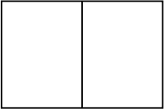

## Fence Optimization

A rancher has 1000 feet of fencing in which to construct adjacent, equally sized rectangular pens. What dimensions should these pens have to maximize the enclosed area?

I will refer to the horizontal sections as X and the vertical sections as Y.  To solve this problem we need to maximize the area (Area = xy) subject to the materials constraint (1000 = 2x + 3y).

We have two equations with two unknowns.  I will solve for y in the second one:

$$1000 = 4x+3y \rightarrow 3y = -4x + 1000 \rightarrow y = -\frac{4}{3}x + \frac{1000}{3}$$

Plugging in the Y into the first equation gives:

$$ A(x) = x \times (-\frac{4}{3}x + \frac{1000}{3}) $$

$$ A(x) = -\frac{4}{3}x^2 + \frac{1000}{3}x $$

In order to maximize we take the derivative of A(x), set it equal to 0 and solve for x:

$$ A'(x) = -\frac{8}{3}x + \frac{1000}{3} $$

$$ 0 = -\frac{8}{3}x + \frac{1000}{3} \rightarrow \frac{8}{3}x = \frac{1000}{3}\rightarrow 3(\frac{8}{3}x) = 3(\frac{1000}{3})\rightarrow 8x = 1000 \rightarrow x = 125$$

Now to solve for Y.  Starting with the contraint equation

$$y = -\frac{4}{3}x + \frac{1000}{3} \rightarrow y = -\frac{4}{3}(125) + \frac{1000}{3} \approx 166.6667$$

So the dimensions of the pen to get the maximum area are *125 x 167 feet*.