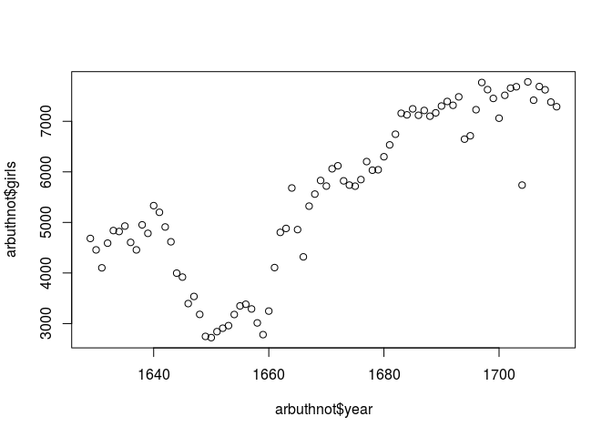
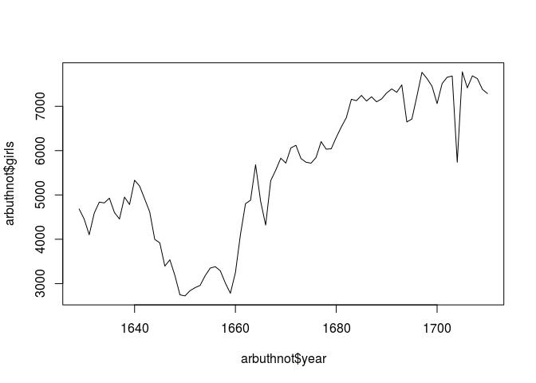
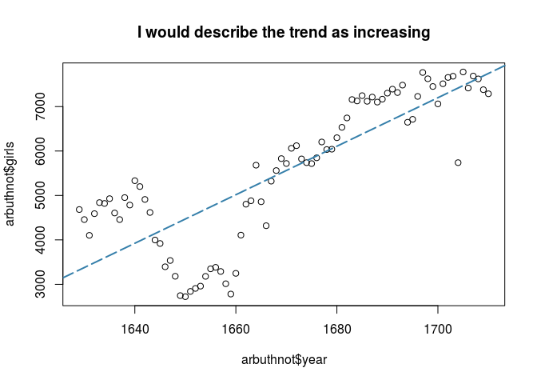
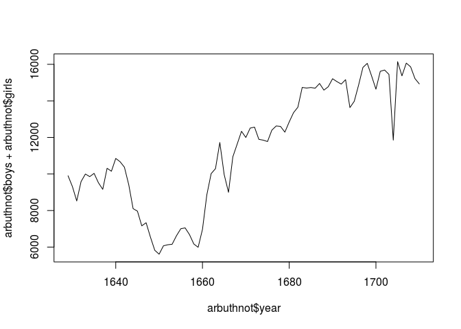
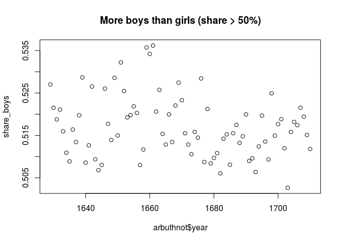

The goal of this lab is to introduce you to R and RStudio, which you'll be using
throughout the course both to learn the statistical concepts discussed in the 
texbook and also to analyze real data and come to informed conclusions.  To 
straighten out which is which: R is the name of the programming language itself 
and RStudio is a convenient interface.

As the labs progress, you are encouraged to explore beyond what the labs dictate;
a willingness to experiment will make you a much better programmer.  Before we 
get to that stage, however, you need to build some basic fluency in R.  Today we
begin with the fundamental building blocks of R and RStudio: the interface, 
reading in data, and basic commands.


The panel in the upper right contains your *workspace* as well as a history of 
the commands that you've previously entered.  Any plots that you generate will 
show up in the panel in the lower right corner.

The panel on the left is where the action happens.  It's called the *console*. 
Everytime you launch RStudio, it will have the same text at the top of the 
console telling you the version of R that you're running.  Below that information
is the *prompt*.  As its name suggests, this prompt is really a request, a 
request for a command.  Initially, interacting with R is all about typing commands
and interpreting the output. These commands and their syntax have evolved over
decades (literally) and now provide what many users feel is a fairly natural way
to access data and organize, describe, and invoke statistical computations.

To get you started, enter the following command at the R prompt (i.e. right after
`>` on the console).  You can either type it in manually or copy and paste it
from this document.


```r
source("~/Documents/CUNY-SPS/DATA606/Lab0/more/arbuthnot.r")
```

This command instructs R to access the OpenIntro website and fetch some data: 
the Arbuthnot baptism counts for boys and girls. You should see that the 
workspace area in the upper righthand corner of the RStudio window now lists a 
data set called `arbuthnot` that has 82 observations on 3 variables. As you 
interact with R, you will create a series of objects. Sometimes you load them as
we have done here, and sometimes you create them yourself as the byproduct of a 
computation or some analysis you have performed. Note that because you are 
accessing data from the web, this command (and the entire assignment) will work 
in a computer lab, in the library, or in your dorm room; anywhere you have 
access to the Internet.

## The Data: Dr. Arbuthnot's Baptism Records

The Arbuthnot data set refers to Dr. John Arbuthnot, an 18<sup>th</sup> century 
physician, writer, and mathematician.  He was interested in the ratio of newborn
boys to newborn girls, so he gathered the baptism records for children born in
London for every year from 1629 to 1710.  We can take a look at the data by 
typing its name into the console.


```r
arbuthnot
```

```
##    year boys girls
## 1  1629 5218  4683
## 2  1630 4858  4457
## 3  1631 4422  4102
## 4  1632 4994  4590
## 5  1633 5158  4839
## 6  1634 5035  4820
## 7  1635 5106  4928
## 8  1636 4917  4605
## 9  1637 4703  4457
## 10 1638 5359  4952
## 11 1639 5366  4784
## 12 1640 5518  5332
## 13 1641 5470  5200
## 14 1642 5460  4910
## 15 1643 4793  4617
## 16 1644 4107  3997
## 17 1645 4047  3919
## 18 1646 3768  3395
## 19 1647 3796  3536
## 20 1648 3363  3181
## 21 1649 3079  2746
## 22 1650 2890  2722
## 23 1651 3231  2840
## 24 1652 3220  2908
## 25 1653 3196  2959
## 26 1654 3441  3179
## 27 1655 3655  3349
## 28 1656 3668  3382
## 29 1657 3396  3289
## 30 1658 3157  3013
## 31 1659 3209  2781
## 32 1660 3724  3247
## 33 1661 4748  4107
## 34 1662 5216  4803
## 35 1663 5411  4881
## 36 1664 6041  5681
## 37 1665 5114  4858
## 38 1666 4678  4319
## 39 1667 5616  5322
## 40 1668 6073  5560
## 41 1669 6506  5829
## 42 1670 6278  5719
## 43 1671 6449  6061
## 44 1672 6443  6120
## 45 1673 6073  5822
## 46 1674 6113  5738
## 47 1675 6058  5717
## 48 1676 6552  5847
## 49 1677 6423  6203
## 50 1678 6568  6033
## 51 1679 6247  6041
## 52 1680 6548  6299
## 53 1681 6822  6533
## 54 1682 6909  6744
## 55 1683 7577  7158
## 56 1684 7575  7127
## 57 1685 7484  7246
## 58 1686 7575  7119
## 59 1687 7737  7214
## 60 1688 7487  7101
## 61 1689 7604  7167
## 62 1690 7909  7302
## 63 1691 7662  7392
## 64 1692 7602  7316
## 65 1693 7676  7483
## 66 1694 6985  6647
## 67 1695 7263  6713
## 68 1696 7632  7229
## 69 1697 8062  7767
## 70 1698 8426  7626
## 71 1699 7911  7452
## 72 1700 7578  7061
## 73 1701 8102  7514
## 74 1702 8031  7656
## 75 1703 7765  7683
## 76 1704 6113  5738
## 77 1705 8366  7779
## 78 1706 7952  7417
## 79 1707 8379  7687
## 80 1708 8239  7623
## 81 1709 7840  7380
## 82 1710 7640  7288
```


What you should see are four columns of numbers, each row representing a 
different year: the first entry in each row is simply the row number (an index 
we can use to access the data from individual years if we want), the second is 
the year, and the third and fourth are the numbers of boys and girls baptized 
that year, respectively. Use the scrollbar on the right side of the console 
window to examine the complete data set.

Note that the row numbers in the first column are not part of Arbuthnot's data. 
R adds them as part of its printout to help you make visual comparisons. You can
think of them as the index that you see on the left side of a spreadsheet. In 
fact, the comparison to a spreadsheet will generally be helpful. R has stored 
Arbuthnot's data in a kind of spreadsheet or table called a *data frame*.

You can see the dimensions of this data frame by typing:


```r
dim(arbuthnot)
```

```
## [1] 82  3
```

This command should output `[1] 82 3`, indicating that there are 82 rows and 3 
columns (we'll get to what the `[1]` means in a bit), just as it says next to 
the object in your workspace. You can see the names of these columns (or 
variables) by typing:


```r
names(arbuthnot)
```

```
## [1] "year"  "boys"  "girls"
```

You should see that the data frame contains the columns `year`,  `boys`, and 
`girls`. At this point, you might notice that many of the commands in R look a 
lot like functions from math class; that is, invoking R commands means supplying
a function with some number of arguments. The `dim` and `names` commands, for 
example, each took a single argument, the name of a data frame. 

One advantage of RStudio is that it comes with a built-in data viewer. Click on
the name `arbuthnot` in the *Environment* pane (upper right window) that lists 
the objects in your workspace. This will bring up an alternative display of the 
data set in the *Data Viewer* (upper left window). You can close the data viewer
by clicking on the *x* in the upper lefthand corner.

## Some Exploration

Let's start to examine the data a little more closely. We can access the data in
a single column of a data frame separately using a command like


```r
arbuthnot$boys
```

```
##  [1] 5218 4858 4422 4994 5158 5035 5106 4917 4703 5359 5366 5518 5470 5460
## [15] 4793 4107 4047 3768 3796 3363 3079 2890 3231 3220 3196 3441 3655 3668
## [29] 3396 3157 3209 3724 4748 5216 5411 6041 5114 4678 5616 6073 6506 6278
## [43] 6449 6443 6073 6113 6058 6552 6423 6568 6247 6548 6822 6909 7577 7575
## [57] 7484 7575 7737 7487 7604 7909 7662 7602 7676 6985 7263 7632 8062 8426
## [71] 7911 7578 8102 8031 7765 6113 8366 7952 8379 8239 7840 7640
```

This command will only show the number of boys baptized each year.

1.  What command would you use to extract just the counts of girls baptized? Try
    it!


```r
arbuthnot$girls
```

```
##  [1] 4683 4457 4102 4590 4839 4820 4928 4605 4457 4952 4784 5332 5200 4910
## [15] 4617 3997 3919 3395 3536 3181 2746 2722 2840 2908 2959 3179 3349 3382
## [29] 3289 3013 2781 3247 4107 4803 4881 5681 4858 4319 5322 5560 5829 5719
## [43] 6061 6120 5822 5738 5717 5847 6203 6033 6041 6299 6533 6744 7158 7127
## [57] 7246 7119 7214 7101 7167 7302 7392 7316 7483 6647 6713 7229 7767 7626
## [71] 7452 7061 7514 7656 7683 5738 7779 7417 7687 7623 7380 7288
```

Notice that the way R has printed these data is different. When we looked at the
complete data frame, we saw 82 rows, one on each line of the display. These data
are no longer structured in a table with other variables, so they are displayed 
one right after another. Objects that print out in this way are called *vectors*;
they represent a set of numbers. R has added numbers in [brackets] along the 
left side of the printout to indicate locations within the vector. For example,
`5218` follows `[1]`, indicating that `5218` is the first entry in the vector. 
And if `[43]` starts a line, then that would mean the first number on that line
would represent the 43<sup>rd</sup> entry in the vector.

R has some powerful functions for making graphics. We can create a simple plot 
of the number of girls baptized per year with the command


```r
plot(x = arbuthnot$year, y = arbuthnot$girls)
```

<!-- -->

By default, R creates a scatterplot with each x,y pair indicated by an open 
circle. The plot itself should appear under the *Plots* tab of the lower right 
panel of RStudio. Notice that the command above again looks like a function, 
this time with two arguments separated by a comma.  The first argument in the 
plot function specifies the variable for the x-axis and the second for the y-axis.
If we wanted to connect the data points with lines, we could add a third argument,
the letter `l` for **l**ine.


```r
plot(x = arbuthnot$year, y = arbuthnot$girls, type = "l")
```

<!-- -->

You might wonder how you are supposed to know that it was possible to add that 
third argument.  Thankfully, R documents all of its functions extensively. To 
read what a function does and learn the arguments that are available to you, 
just type in a question mark followed by the name of the function that you're 
interested in. Try the following.


```r
?plot
```

Notice that the help file replaces the plot  in the lower right panel. You can 
toggle between plots and help files using the tabs at the top of that panel.

2.  Is there an apparent trend in the number of girls baptized over the years?  
    How would you describe it?
    

```r
plot(x = arbuthnot$year, y = arbuthnot$girls, main = 'I would describe the trend as increasing')
abline(lm(arbuthnot$girls ~ arbuthnot$year), col="#357FAA", lty='longdash', lwd=2)
```

<!-- -->

Now, suppose we want to plot the total number of baptisms.  To compute this, we 
could use the fact that R is really just a big calculator. We can type in 
mathematical expressions like


```r
5218 + 4683
```

```
## [1] 9901
```

to see the total number of baptisms in 1629. We could repeat this once for each 
year, but there is a faster way. If we add the vector for baptisms for boys and
girls, R will compute all sums simultaneously.


```r
arbuthnot$boys + arbuthnot$girls
```

```
##  [1]  9901  9315  8524  9584  9997  9855 10034  9522  9160 10311 10150
## [12] 10850 10670 10370  9410  8104  7966  7163  7332  6544  5825  5612
## [23]  6071  6128  6155  6620  7004  7050  6685  6170  5990  6971  8855
## [34] 10019 10292 11722  9972  8997 10938 11633 12335 11997 12510 12563
## [45] 11895 11851 11775 12399 12626 12601 12288 12847 13355 13653 14735
## [56] 14702 14730 14694 14951 14588 14771 15211 15054 14918 15159 13632
## [67] 13976 14861 15829 16052 15363 14639 15616 15687 15448 11851 16145
## [78] 15369 16066 15862 15220 14928
```

What you will see are 82 numbers (in that packed display, because we aren't 
looking at a data frame here), each one representing the sum we're after. Take a
look at a few of them and verify that they are right. Therefore, we can make a 
plot of the total number of baptisms per year with the command


```r
plot(arbuthnot$year, arbuthnot$boys + arbuthnot$girls, type = "l")
```

<!-- -->

This time, note that we left out the names of the first two arguments.  We can 
do this because the help file shows that the default for `plot` is for the first
argument to be the x-variable and the second argument to be the y-variable.

Similarly to how we computed the proportion of boys, we can compute the ratio of
the number of boys to the number of girls baptized in 1629 with


```r
5218 / 4683
```

```
## [1] 1.114243
```

or we can act on the complete vectors with the expression


```r
arbuthnot$boys / arbuthnot$girls
```

```
##  [1] 1.114243 1.089971 1.078011 1.088017 1.065923 1.044606 1.036120
##  [8] 1.067752 1.055194 1.082189 1.121656 1.034884 1.051923 1.112016
## [15] 1.038120 1.027521 1.032661 1.109867 1.073529 1.057215 1.121267
## [22] 1.061719 1.137676 1.107290 1.080095 1.082416 1.091371 1.084565
## [29] 1.032533 1.047793 1.153901 1.146905 1.156075 1.085988 1.108584
## [36] 1.063369 1.052697 1.083121 1.055242 1.092266 1.116143 1.097744
## [43] 1.064016 1.052778 1.043112 1.065354 1.059647 1.120575 1.035467
## [50] 1.088679 1.034100 1.039530 1.044237 1.024466 1.058536 1.062860
## [57] 1.032846 1.064054 1.072498 1.054359 1.060974 1.083128 1.036526
## [64] 1.039092 1.025792 1.050850 1.081931 1.055748 1.037981 1.104904
## [71] 1.061594 1.073219 1.078254 1.048981 1.010673 1.065354 1.075460
## [78] 1.072132 1.090022 1.080808 1.062331 1.048299
```

The proportion of newborns that are boys


```r
5218 / (5218 + 4683)
```

```
## [1] 0.5270175
```

or this may also be computed for all years simultaneously:


```r
arbuthnot$boys / (arbuthnot$boys + arbuthnot$girls)
```

```
##  [1] 0.5270175 0.5215244 0.5187705 0.5210768 0.5159548 0.5109082 0.5088698
##  [8] 0.5163831 0.5134279 0.5197362 0.5286700 0.5085714 0.5126523 0.5265188
## [15] 0.5093518 0.5067868 0.5080341 0.5260366 0.5177305 0.5139059 0.5285837
## [22] 0.5149679 0.5322023 0.5254569 0.5192526 0.5197885 0.5218447 0.5202837
## [29] 0.5080030 0.5116694 0.5357262 0.5342132 0.5361942 0.5206108 0.5257482
## [36] 0.5153557 0.5128359 0.5199511 0.5134394 0.5220493 0.5274422 0.5232975
## [43] 0.5155076 0.5128552 0.5105507 0.5158214 0.5144798 0.5284297 0.5087122
## [50] 0.5212285 0.5083822 0.5096910 0.5108199 0.5060426 0.5142178 0.5152360
## [57] 0.5080788 0.5155165 0.5174905 0.5132301 0.5147925 0.5199527 0.5089677
## [64] 0.5095857 0.5063659 0.5123973 0.5196766 0.5135590 0.5093183 0.5249190
## [71] 0.5149385 0.5176583 0.5188268 0.5119526 0.5026541 0.5158214 0.5181790
## [78] 0.5174052 0.5215362 0.5194175 0.5151117 0.5117899
```

Note that with R as with your calculator, you need to be conscious of the order 
of operations.  Here, we want to divide the number of boys by the total number 
of newborns, so we have to use parentheses.  Without them, R will first do the 
division, then the addition, giving you something that is not a proportion.

3.  Now, make a plot of the proportion of boys over time. What do you see? Tip: 
If you use the up and down arrow keys, you can scroll through your previous 
commands, your so-called command history. You can also access it by clicking on 
the history tab in the upper right panel.  This will save you a lot of typing in
the future.


```r
share_boys <- arbuthnot$boys / (arbuthnot$boys + arbuthnot$girls)
plot(x = arbuthnot$year, y = share_boys, main = 'More boys than girls (share > 50%)')
```

<!-- -->

Finally, in addition to simple mathematical operators like subtraction and 
division, you can ask R to make comparisons like greater than, `>`, less than,
`<`, and equality, `==`. For example, we can ask if boys outnumber girls in each 
year with the expression


```r
arbuthnot$boys > arbuthnot$girls
```

```
##  [1] TRUE TRUE TRUE TRUE TRUE TRUE TRUE TRUE TRUE TRUE TRUE TRUE TRUE TRUE
## [15] TRUE TRUE TRUE TRUE TRUE TRUE TRUE TRUE TRUE TRUE TRUE TRUE TRUE TRUE
## [29] TRUE TRUE TRUE TRUE TRUE TRUE TRUE TRUE TRUE TRUE TRUE TRUE TRUE TRUE
## [43] TRUE TRUE TRUE TRUE TRUE TRUE TRUE TRUE TRUE TRUE TRUE TRUE TRUE TRUE
## [57] TRUE TRUE TRUE TRUE TRUE TRUE TRUE TRUE TRUE TRUE TRUE TRUE TRUE TRUE
## [71] TRUE TRUE TRUE TRUE TRUE TRUE TRUE TRUE TRUE TRUE TRUE TRUE
```

This command returns 82 values of either `TRUE` if that year had more boys than 
girls, or `FALSE` if that year did not (the answer may surprise you). This 
output shows a different kind of data than we have considered so far. In the 
`arbuthnot` data frame our values are numerical (the year, the number of boys 
and girls). Here, we've asked R to create *logical* data, data where the values
are either `TRUE` or `FALSE`. In general, data analysis will involve many 
different kinds of data types, and one reason for using R is that it is able to
represent and compute with many of them.

This seems like a fair bit for your first lab, so let's stop here. To exit 
RStudio you can click the *x* in the upper right corner of the whole window.  
You will be prompted to save your workspace. If you click *save*, RStudio will 
save the history of your commands and all the objects in your workspace so that 
the next time you launch RStudio, you will see `arbuthnot` and you will have 
access to the commands you typed in your previous session. For now, click *save*,
then start up RStudio again.

* * *

## On Your Own

In the previous few pages, you recreated some of the displays and preliminary 
analysis of Arbuthnot's baptism data. Your assignment involves repeating these 
steps, but for present day birth records in the United States.  Load up the 
present day data with the following command.


```r
source("~/Documents/CUNY-SPS/DATA606/Lab0/more/present.R")
```

The data are stored in a data frame called `present`.

-   What years are included in this data set? What are the dimensions of the 
    data frame and what are the variable or column names?
    

```r
unique(present$year)
```

```
##  [1] 1940 1941 1942 1943 1944 1945 1946 1947 1948 1949 1950 1951 1952 1953
## [15] 1954 1955 1956 1957 1958 1959 1960 1961 1962 1963 1964 1965 1966 1967
## [29] 1968 1969 1970 1971 1972 1973 1974 1975 1976 1977 1978 1979 1980 1981
## [43] 1982 1983 1984 1985 1986 1987 1988 1989 1990 1991 1992 1993 1994 1995
## [57] 1996 1997 1998 1999 2000 2001 2002
```

**1940 to 2002**


```r
dim(present)
```

```
## [1] 63  3
```

**63 rows and 3 columns**


```r
names(present)
```

```
## [1] "year"  "boys"  "girls"
```

-   How do these counts compare to Arbuthnot's? Are they on a similar scale?


```r
suppressMessages(library(dplyr))

combined <- rbind(arbuthnot, present) %>%
  mutate(total = boys + girls) %>%
  mutate(Dataset = ifelse(year > 1939, 'Present', 'Arbuthnot'))

combined %>%
  group_by(Dataset) %>%
  summarise(`Average records per year` = mean(total))
```

```
## # A tibble: 2 x 2
##   Dataset   `Average records per year`
##   <chr>                          <dbl>
## 1 Arbuthnot                     11442.
## 2 Present                     3679515.
```

**Present dataset has significantly more records per year than Arbuthnot's**

-   Make a plot that displays the boy-to-girl ratio for every year in the data 
    set. What do you see? Does Arbuthnot's observation about boys being born in
    greater proportion than girls hold up in the U.S.? Include the plot in your 
    response.


```r
library(ggplot2)
combined %>%
  mutate(`Boy-to-Girl Ratio` = boys / girls) %>%
  ggplot(., aes(x = Dataset, y = `Boy-to-Girl Ratio`, fill = Dataset)) + 
  geom_boxplot(show.legend = FALSE) 
```

<!-- -->

**Arbuthnot's observations does not hold in the Present dataset**

-   In what year did we see the most total number of births in the U.S.? You can
    refer to the help files or the R reference card 
    [http://cran.r-project.org/doc/contrib/Short-refcard.pdf](http://cran.r-project.org/doc/contrib/Short-refcard.pdf)
    to find helpful commands.
    

```r
combined[combined$year == max(combined$year),]$year
```

```
## [1] 2002
```

These data come from a report by the Centers for Disease Control 
[http://www.cdc.gov/nchs/data/nvsr/nvsr53/nvsr53_20.pdf](http://www.cdc.gov/nchs/data/nvsr/nvsr53/nvsr53_20.pdf). 
Check it out if you would like to read more about an analysis of sex ratios at 
birth in the United States.

That was a short introduction to R and RStudio, but we will provide you with more
functions and a more complete sense of the language as the course progresses. 
Feel free to browse around the websites for [R](http://www.r-project.org) and 
[RStudio](http://rstudio.org) if you're interested in learning more, or find 
more labs for practice at http://openintro.org.

<div id="license">
This is a product of OpenIntro that is released under a 
[Creative Commons Attribution-ShareAlike 3.0 Unported](http://creativecommons.org/licenses/by-sa/3.0). 
This lab was adapted for OpenIntro by Andrew Bray and Mine &Ccedil;etinkaya-Rundel
from a lab written by Mark Hansen of UCLA Statistics.
</div>
